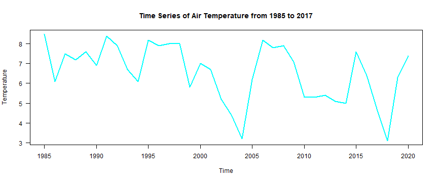
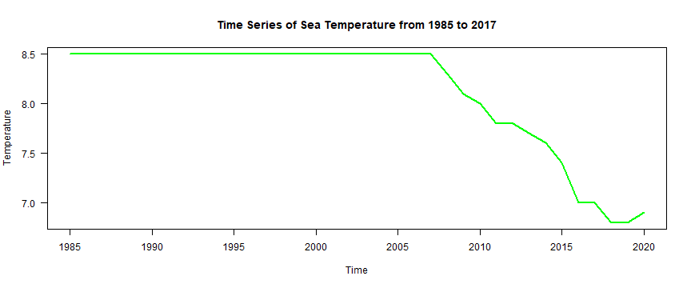

Analysis of Weather Data from Buoy 46035
========================================================
author: Natalya Shelchkova
date: 
autosize: true


Introduction
========================================================

Given the recent talks regarding climate change and global warming, we decided to look at the air and sea temperatures recorded from buoy 46035 at noon every day in order to analyze whether there has been an overall change in temperatures over the last 30 years.

Data was gathered from: <http://www.ndbc.noaa.gov/station_page.php?station=46035>

Air Temperature Changes Over Time
========================================================



```

	Welch Two Sample t-test

data:  air_1985 and air_2017
t = -1.0783, df = 351.89, p-value = 0.2817
alternative hypothesis: true difference in means is not equal to 0
95 percent confidence interval:
 -0.8849579  0.2582113
sample estimates:
mean of x mean of y 
 4.298165  4.611538 
```

***

Let's look at the change in air temperatures over the last 30 years. As we can see on the graph, air temperature has not changed much over the last 30 years, and this evidence is further comfirmed via t-test.

**Null Hypothesis:** $${\huge \mu_{air 1985} = \mu_{air 2017} }$$
**Alternative Hypothesis:** $${\huge \mu_{air 1985} \neq \mu_{air 2017} }$$

**P-value:** 0.2817

Since the P-value is greater than 0.05, we accept the null hypothesis, thus air temperatures have not changed in the last 30 years.

Sea Temperature Changes Over Time
========================================================



```

	Welch Two Sample t-test

data:  sea_1985 and sea_2017
t = -0.89216, df = 309.54, p-value = 0.373
alternative hypothesis: true difference in means is not equal to 0
95 percent confidence interval:
 -0.6482572  0.2437910
sample estimates:
mean of x mean of y 
 5.880734  6.082967 
```

***

Now let's look at the change in sea temperature over time. As we can see, the sea temperature has also remained constant throughout the last 30 years.

**Null Hypothesis:** $${\huge \mu_{sea 1985} = \mu_{sea 2017} }$$
**Alternative Hypothesis:** $${\huge \mu_{sea 1985} \neq \mu_{sea 2017} }$$

**P-value:** 0.373

Since the P-value is greater than 0.05, we accept the null hypothesis and state that the mean sea temperature has not changed over the last 30 years. 

Issues
========================================================

Despite the large data size, we encounter issues in terms of inconsistent and missing data: 

- The data from 1985 starts in mid-September, and in later years there are days and potentially weeks which are missing from the data set. 
  - In fact, the year 2013 is completely missing from the data set
- Furthermore, the sea and air temperature data periodically reports missing values as '999.0' which I modified by replacing it with an interpolation of sea/air temperatures as an attempt to preserve the data. 
- Also, gathering one data point from a 24-hour day does not give us a good estimate of sea temperatures due to such a small sampling size in relation to the amount of potential data points per day.
  - However, while larger sample sizes will help reduce standard deviation and variance allowing for more precise measurements, there comes a time in which gathering more data doesn't result in huge changes to your statistics


