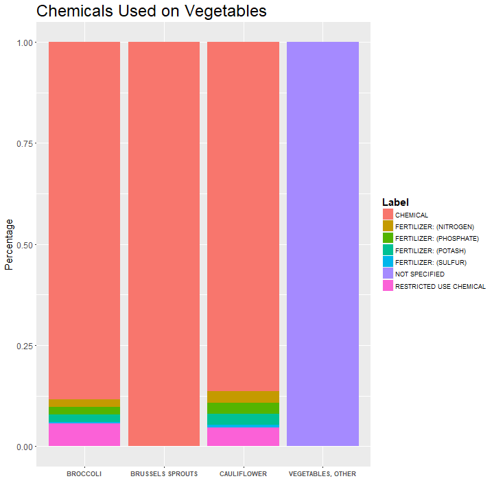
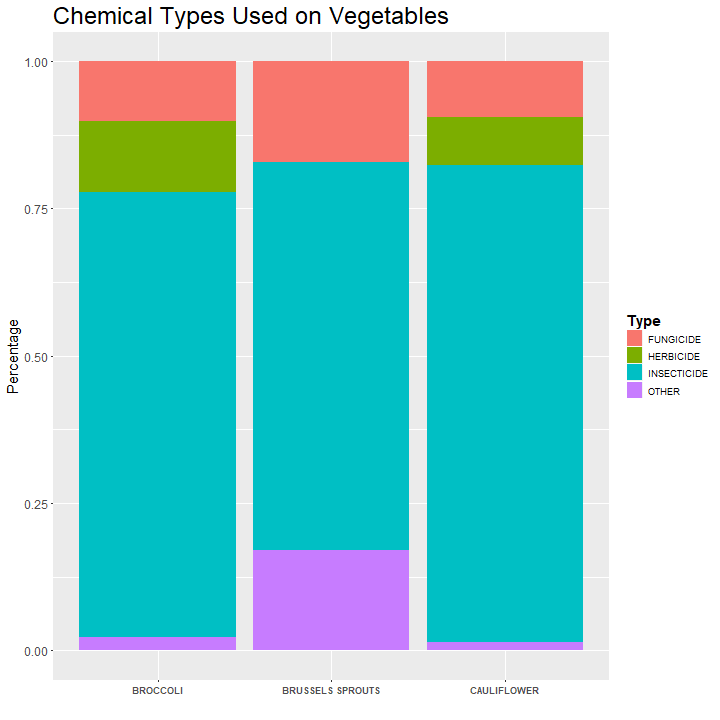
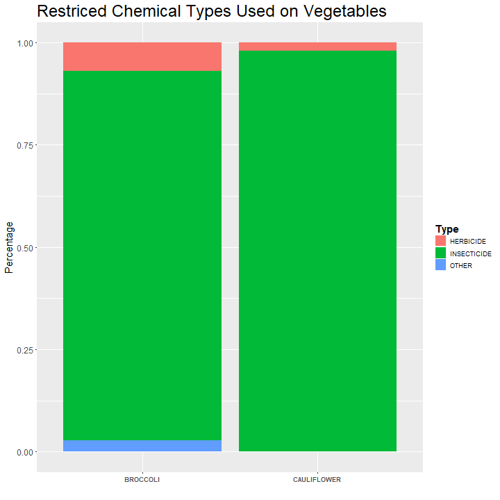
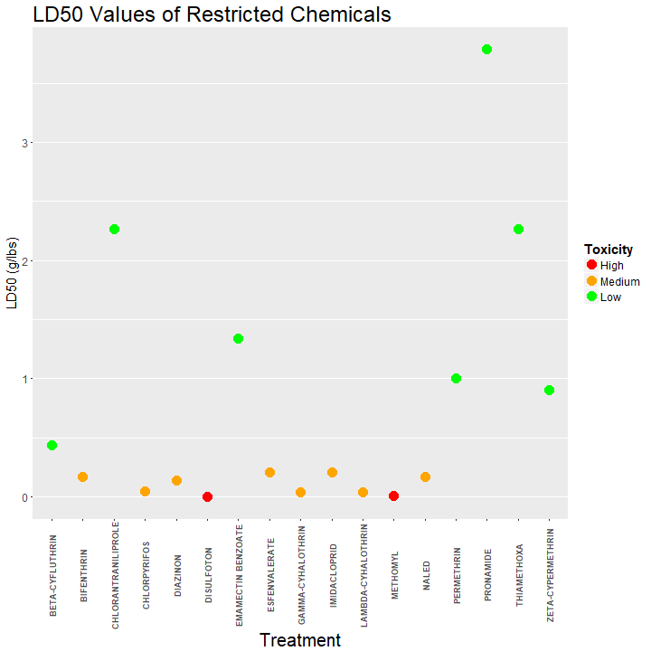
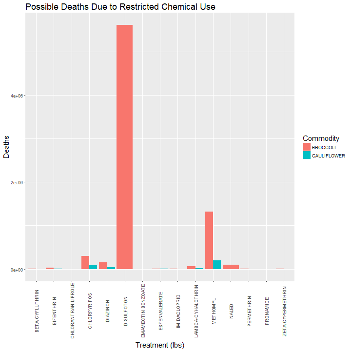
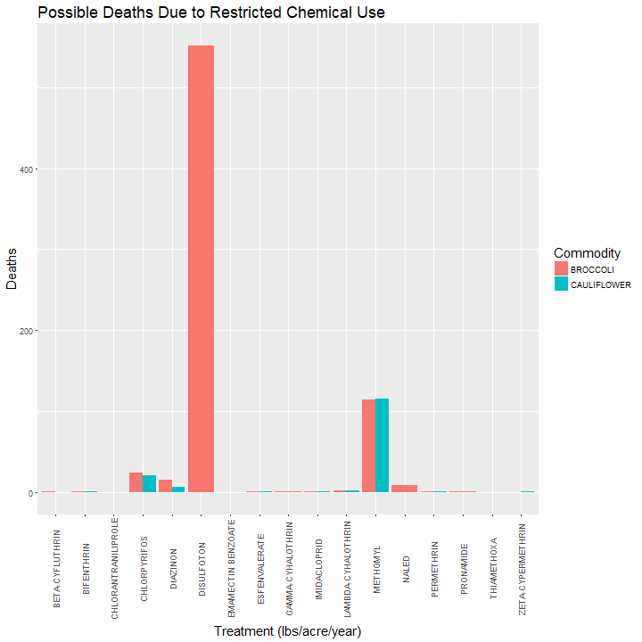

What Veggies are Made With
========================================================
author: Natalya Shelchkova
date: 
autosize: true

Introduction
========================================================

 
 
In order to control for pests and diseases, the government started spraying vegetables with different chemicals. We will be looking at how different vegetables are treated differently, specifically brocolli, brussel sprouts, and cauliflower based on: 

- Number of chemical used on each vegetable
- The types of chemicals used on each vegetable
- The toxicity of the restricted use chemicals

Data was gathered from:  <https://support.rstudio.com/hc/en-us/articles/200486468>. 

Chemicals Used on Vegetables
========================================================

***

 
 
 First let's understand the types of chemicals that are used on our vegetables:
- **Chemical**: Substances such as fungicides, herbicides, and insecticides which are used to kill pests
- **Fertilizer**: Used to help promote the growth of vegetables by providing them with extra nutrients
- **Restricted Use Chemicals**: Chemicals carefully monitored by the EPA due to their potentially harmful effects 

Breakdown of Chemical Types
========================================================

***

 
 
 Now let's break up the chemicals into their various subgroups:
- **Insecticide**: Substances used to kill insects
- **Fungicide**: Substances used to kill fungi (mushrooms)
- **Herbicide**: Substances used to kill harmful or unwanted plants
- **Other**: Chemicals that do not fit into any of the other categories 

Breakdown of the Restricted Use Chemicals
========================================================

***

 
 Since the restricted use chemicals are monitored by the EPA due to their potentially harful side effects, let's look more closely at how they are used to treat our vegetables 

*Brussel sprouts are not shown since they either have no restricted chemical use, or the measurements for amount of chemicals used was withheld* 

Toxicity of the Restricted Use Chemicals
========================================================

***

 
 By looking at the LD50, or the amount in g/lbs that is needed to kill half of the population, we can determine the toxicity of these different chemicals:
- **High**: LD50 < 0.0226796
- **Medium**: 0.0231332 < LD50 < 0.226796
- **Low**: LD50 > 0.226796

*These categories were determined by using criteria from: <http://pmep.cce.cornell.edu/profiles/extoxnet/TIB/dose-response.html>* 

The Results of Restricted Chemical Use on Human Life
========================================================

***

Based on the measurements provided by the USDA, the number of deaths due to each chemical is shown above. Its is important to note the x axis labels; the one on the left shows possible human deaths based on how much chemical was used (measured in pounds), however, the specifics of that measurement are never explained. 

The Results of Restricted Chemical Use on Human Life
========================================================

 ***

Thus, a more reliable measure of possible human deaths is illustrated on the right; in this graph, we have the measurements in terms of lbs/acre/year. While it is still unclear about the exact procedures by which these chemicals are put onto the vegetables, if we look at the extreme case in which the entire years worth of chemicals was sprayed on one acre of vegetables all at once, the numbers shows are the number of people each chemical would kill. However, it should be safe to assume that this is not the case, and that the applications occur over time which allows does not allow the chemicals to accumulate and allows for a safe consumption of vegetables. 

